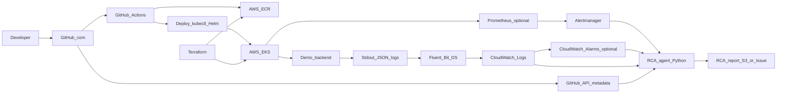

# RCA Finder POC — End-to-End Playbook

This document is the **single source of truth** for building a minimal-cost proof of concept: a demo backend with Postgres, containerized and deployed to **AWS EKS** via **Terraform**, with **GitHub Actions** CI/CD, **log shipping** to **CloudWatch**, **alert-driven activation** of a **Python RCA agent**, and a **scenario matrix** that exercises common production failure classes in a **lab-safe** way.

---

## Table of contents

1. [Executive summary](#1-executive-summary)
2. [Architecture](#2-architecture)
3. [Cost guardrails (AWS POC)](#3-cost-guardrails-aws-poc)
4. [Prerequisites and accounts](#4-prerequisites-and-accounts)
5. [Repository layout](#5-repository-layout)
6. [Phase A — Local product slice](#phase-a--local-product-slice)
7. [Phase B — Containerization and K8s contract](#phase-b--containerization-and-k8s-contract)
8. [Phase C — AWS baseline (Terraform)](#phase-c--aws-baseline-terraform)
9. [Phase D — EKS (minimal cluster)](#phase-d--eks-minimal-cluster)
10. [Phase E — GitHub Actions CI/CD](#phase-e--github-actions-cicd)
11. [Phase F — Observability (logs and real-time monitoring)](#phase-f--observability-logs-and-real-time-monitoring)
12. [Phase G — RCA agent (Python)](#phase-g--rca-agent-python)
13. [Phase H — Agent activation (alerts → webhook)](#phase-h--agent-activation-alerts--webhook)
14. [Phase I — Scenario test matrix (8 categories)](#phase-i--scenario-test-matrix-8-categories)
15. [Phase J — Hardening and teardown](#phase-j--hardening-and-teardown)
16. [Risks and mitigations](#16-risks-and-mitigations)
17. [Appendix A — Webhook payload schema](#appendix-a--webhook-payload-schema)
18. [Appendix B — GitHub-hosted vs self-hosted runners](#appendix-b--github-hosted-vs-self-hosted-runners)

---

## 1. Executive summary

### 1.1 Scope (in)

- Minimal **Python** HTTP API backed by **Postgres**, with **structured JSON logs** and **deterministic failure injection** via environment variables (for repeatable RCA drills).
- **Docker** image published to **Amazon ECR**, deployed to **Amazon EKS** (Kubernetes on AWS).
- **Infrastructure as code** with **Terraform** (remote state on S3 + DynamoDB locking).
- **GitHub Actions** workflows: test, build, publish to ECR, deploy to EKS, smoke test.
- **Log visibility**: pod logs via `kubectl logs -f`, and (when configured) **Fluent Bit → CloudWatch Logs** for retention and **Logs Insights** queries for the agent.
- **RCA agent**: HTTP service that accepts an **incident webhook**, gathers **evidence** (logs window, Kubernetes events, optional GitHub metadata), calls an **LLM** with a **strict output schema**, returns/stores an RCA artifact.
- **Automation**: at least one path where a **synthetic failure** triggers an **alert** that **POSTs** to the agent (e.g., **Prometheus + Alertmanager** in-cluster, or **CloudWatch Alarm → SNS → Lambda**).

### 1.2 Non-goals (out)

- Production-grade HA across multiple regions, full SOC2 controls, or complete SRE platform.
- Perfect “real-time” log streaming into the LLM (use **recent time windows** and **Logs Insights**; human “live tail” uses **CloudWatch Live Tail** or `kubectl logs -f`).
- Real offensive security testing against third parties or the public internet.

### 1.3 Safety boundaries

- **Human error, bugs, DB, overload, third-party mock**: keep all injections **inside your AWS account** and **your GitHub repository**.
- **Security attacks**: simulate only with **tools you run** (e.g., `vegeta`, `hey`) against **your own** Service/LoadBalancer in a **dedicated lab account/VPC**. Do not target external sites.
- **Hardware / node failure**: perform **cordoned/drained** experiments or **managed node group** scale-down only in **non-production** clusters.

---

## 2. Architecture

### 2.1 Narrative

1. A developer pushes to **GitHub**. **GitHub Actions** builds the **demo app** image and pushes to **ECR**.
2. The same workflow (or a protected manual job) runs **Terraform** or **kubectl/helm** to roll out the **Deployment** on **EKS**.
3. Application pods emit **JSON logs** to stdout; a **DaemonSet** (Fluent Bit) ships logs to **CloudWatch Logs**.
4. **Metrics and events** (kube-state-metrics, Prometheus, or CloudWatch metrics) feed **alarms** (Alertmanager or CloudWatch).
5. On firing, the alerting path invokes the **RCA agent** `POST /incidents` with a time window and labels.
6. The agent pulls **log excerpts**, **Kubernetes events**, and optionally **GitHub API** data (commits, workflow runs) for correlation, then calls the **LLM** (OpenAI, Anthropic, or **Amazon Bedrock**).
7. The agent returns a **structured RCA** (hypothesis, evidence, mitigations). Store the result in **S3** and/or a **GitHub issue** comment for auditability.

### 2.2 Diagram



---

## 3. Cost guardrails (AWS POC)

| Item | POC guidance |
|------|----------------|
| **EKS control plane** | Hourly charge is unavoidable; **destroy the cluster** when not demoing. |
| **Worker nodes** | Use **1–2** small instances (e.g., `t3.small` / `t3.medium`) or a **single** Fargate profile (tradeoff: debugging/cold start). **Single AZ** is acceptable. |
| **NAT Gateway** | Often the **largest** fixed cost in a small VPC. Options: **one NAT** for POC, **VPC endpoints** for S3/ECR to reduce data path costs, or schedule **nightly teardown**. |
| **Container Insights** | Useful but can **increase cost**; start with **Fluent Bit + Logs Insights** and basic CPU/memory before enabling full Container Insights. |
| **Log retention** | Set **short retention** (e.g., 1–7 days) on log groups for POC. |
| **ECR** | Add **lifecycle policy** (keep last N images). |
| **Spot** | Optional for nodes; **cheaper** but nodes may disappear—good for “hardware” demos, confusing for first-time setup. |
| **Load balancers** | Prefer **`kubectl port-forward`** for early integration; add **ALB** only when you need external demos. |

**Completion criteria (cost discipline)**

- [ ] You have a written **monthly budget alarm** (AWS Billing) for the lab account.
- [ ] You have a **teardown checklist** (Phase J) executed at least once successfully.

---

## 4. Prerequisites and accounts

### 4.1 Tools (local)

- [ ] **Docker Desktop** or equivalent (Linux: docker engine + compose plugin).
- [ ] **kubectl** matching your EKS version (within one minor version).
- [ ] **Terraform** `>= 1.5` (or team standard).
- [ ] **AWS CLI v2** configured with a **lab** profile.
- [ ] **Helm** `>= 3.12` (if using Helm charts from the playbook).

### 4.2 Cloud accounts

- [ ] **AWS account** used only for this POC (recommended).
- [ ] **GitHub** organization or account with **Actions** enabled for this repository.

### 4.3 Access patterns

- [ ] Human admin uses **IAM Identity Center** or **IAM user/MFA** (team policy).
- [ ] GitHub Actions uses **OIDC federation to AWS** (preferred) for `sts:AssumeRoleWithWebIdentity` (see Phase E).

---

## 5. Repository layout

| Path | Purpose |
|------|---------|
| [`docs/RCA_POC_PLAYBOOK.md`](RCA_POC_PLAYBOOK.md) | This playbook |
| `app/` | Demo FastAPI service + Dockerfile |
| `agent/` | RCA webhook service + Dockerfile |
| `deploy/k8s/` | Kubernetes manifests (app, agent, RBAC, optional Prometheus) |
| `terraform/` | VPC, ECR, EKS, IAM for CI |
| `docker-compose.yml` | Local Postgres + app |
| [`.github/workflows/ci.yml`](../.github/workflows/ci.yml) | Lint, K8s dry-run, Terraform validate |
| [`.github/workflows/build-push-ecr.yml`](../.github/workflows/build-push-ecr.yml) | Build/push images to ECR (OIDC on `main`) |
| [`.github/workflows/deploy-eks-manual.yml`](../.github/workflows/deploy-eks-manual.yml) | Manual `kubectl apply` (secrets required) |
| [`.github/workflows/smoke-eks-manual.yml`](../.github/workflows/smoke-eks-manual.yml) | Manual in-cluster `/health` check |
| [`README.md`](../README.md) | Quick start pointer |

---

## Phase A — Local product slice

**Goal:** Run the API and Postgres locally with structured logs and **injection toggles** so later phases can reproduce failures without ambiguity.

### Checklist

- [ ] **A.1** Clone this repository and copy `.env.example` to `.env` (create if missing in your branch).
- [ ] **A.2** Start stack: `docker compose up --build`.
- [ ] **A.3** Verify **`GET /health`** returns HTTP 200 JSON.
- [ ] **A.4** Verify **`GET /ready`** returns 200 only when DB is reachable (stop DB container to see 503).
- [ ] **A.5** Verify **`GET /items`** performs a read against Postgres.
- [ ] **A.6** Confirm logs are **single-line JSON** with fields at minimum: `timestamp`, `level`, `message`, `service`, `trace_id`, and when applicable `http.route`, `db.latency_ms`.
- [ ] **A.7** Exercise injection env vars (see app README / table below):
  - [ ] `INJECT_DB_SLOW_MS` — adds delay to DB operations.
  - [ ] `INJECT_UPSTREAM_TIMEOUT` — simulates third-party timeout behavior in-process.
  - [ ] `INJECT_CRASH_AFTER_REQUESTS` — process exits after N requests (simulates fatal bug / OOM loop when combined with restart policy).
  - [ ] `INJECT_ERROR_RATE_PERCENT` — random 500s on selected routes.

### Injection toggles (reference)

| Variable | Effect |
|----------|--------|
| `INJECT_DB_SLOW_MS` | Sleep before/after DB calls (ms). |
| `INJECT_UPSTREAM_TIMEOUT` | `1` makes “external” call path always time out (mock third-party). |
| `INJECT_CRASH_AFTER_REQUESTS` | Exit process after N handled requests. |
| `INJECT_ERROR_RATE_PERCENT` | 0–100 fraction of requests return 500 on `/items`. |

### Completion criteria (Phase A)

- [ ] `docker compose up` brings up **app + db**; `/health` is 200.
- [ ] `/ready` reflects DB connectivity.
- [ ] Logs are **JSON** to stdout.
- [ ] At least **two** injection modes verified manually.

### Artifacts

- `docker-compose.yml`, `app/`, `.env` (local only, never commit secrets).

---

## Phase B — Containerization and K8s contract

**Goal:** Same behavior in a container locally and as a Deployment on Kubernetes.

### Checklist

- [ ] **B.1** Build image: `docker build -t demo-app:local ./app`.
- [ ] **B.2** Run with same env vars as compose; verify `/health` and `/items`.
- [ ] **B.3** Apply Kubernetes manifests with dry run:  
  `kubectl apply -f deploy/k8s/app/ --dry-run=client`
- [ ] **B.4** Define **ConfigMap** for non-secret config (injection toggles for lab only—**do not** enable injections in any real production environment).
- [ ] **B.5** Define **Secret** for `DATABASE_URL` (use Sealed Secrets or External Secrets in real environments; for POC base64 Secret is acceptable **only** in lab).

### Completion criteria (Phase B)

- [ ] Image runs as **non-root** (see Dockerfile `USER`).
- [ ] `kubectl apply --dry-run=client` succeeds for all app manifests.

### Artifacts

- `app/Dockerfile`, `deploy/k8s/app/*`.

---

## Phase C — AWS baseline (Terraform)

**Goal:** Remote state, VPC, ECR, and IAM roles before EKS to keep `terraform plan` reviewable.

### Checklist

- [ ] **C.1** Create **S3 bucket** for Terraform state (versioning ON, encryption ON, block public access ON).
- [ ] **C.2** Create **DynamoDB table** `terraform-locks` with partition key `LockID` (String).
- [ ] **C.3** Configure backend in `terraform/backend.hcl` (or CI vars) — **do not** commit bucket names if policy forbids; use `backend.hcl.example`.
- [ ] **C.4** Apply **VPC** module: public + private subnets (POC: **single NAT**).
- [ ] **C.5** Apply **ECR** repositories: `demo-app`, `rca-agent` with lifecycle policy (keep last 10 images).
- [ ] **C.6** Create **IAM OIDC trust** for GitHub Actions (see Phase E) and an **IAM role** for CI with policies: ECR push, EKS describe/update, **optional** Terraform state access.

### Completion criteria (Phase C)

- [ ] `terraform init` + `terraform plan` succeeds from a clean clone (with backend config supplied).
- [ ] ECR repositories visible in console; state locking prevents concurrent apply.

### Artifacts

- `terraform/modules/vpc`, `terraform/modules/ecr`, `terraform/modules/iam-github-oidc`, `terraform/environments/poc/*`.

---

## Phase D — EKS (minimal cluster)

**Goal:** A running cluster that can pull from ECR and run your Deployments.

### Checklist

- [ ] **D.1** Create EKS cluster (version pinned) with **one** managed node group (or Fargate profile — document choice).
- [ ] **D.2** Install **VPC CNI** (default) and ensure nodes can reach ECR/API endpoints (NAT or endpoints).
- [ ] **D.3** Configure **`kubectl`** via `aws eks update-kubeconfig`.
- [ ] **D.4** (Optional cost) **AWS Load Balancer Controller** — skip until you need public ingress.
- [ ] **D.5** **IRSA**: create IAM roles for **app** (if it needs AWS APIs) and **agent** (CloudWatch Logs read, S3 put) and annotate Kubernetes ServiceAccounts.

### Completion criteria (Phase D)

- [ ] `kubectl get nodes` shows **Ready**.
- [ ] You can run a **pause** or **demo-app** pod that pulls from **ECR**.
- [ ] `kubectl logs -f deployment/demo-app -n poc` works.

### Artifacts

- `terraform/modules/eks`, kubeconfig context documented in `README.md`.

---

## Phase E — GitHub Actions CI/CD

**Goal:** Push-to-deploy with **short-lived** AWS credentials (no static `AWS_ACCESS_KEY_ID` in GitHub).

### Checklist

- [ ] **E.1** In AWS IAM, ensure an **OIDC identity provider** exists for `https://token.actions.githubusercontent.com` (Terraform module `iam-github-oidc`, or create once per account — see [GitHub: Configure OIDC in AWS](https://docs.github.com/en/actions/deployment/security-hardening-your-deployments/configuring-openid-connect-in-amazon-web-services)).
- [ ] **E.2** Create a role (e.g. `github-actions-poc-rca`) with trust policy conditioned on:
  - `StringEquals`: `token.actions.githubusercontent.com:aud` = `sts.amazonaws.com`
  - `StringLike`: `token.actions.githubusercontent.com:sub` = `repo:YOUR_ORG/YOUR_REPO:ref:refs/heads/main` (add more `sub` patterns only if needed, e.g. release tags).
- [ ] **E.3** Attach policies: **ECR** push/pull for your repos; **eks:DescribeCluster**; **sts:GetCallerIdentity**; deploy via **`kubectl`** using an auth mechanism:
  - **Option 1 (common):** store a **narrow** `KUBECONFIG` secret generated from a deploy bot IAM user (POC only), **rotated**; or
  - **Option 2 (better):** use **`aws eks update-kubeconfig`** in a job with an OIDC role that maps to EKS **access entries** (avoid granting `system:masters` outside lab).
- [ ] **E.4** Add workflows under `.github/workflows/`: CI (`ci.yml`), build/push (`build-push-ecr.yml`), optional manual deploy/smoke (`deploy-eks-manual.yml`, `smoke-eks-manual.yml`).
- [ ] **E.5** In the GitHub repo, add **Actions secrets** / **variables** the workflows expect (see table below). Use **`aws-actions/configure-aws-credentials`** with `id-token: write` permission on jobs that assume the role.
- [ ] **E.6** Protect `main`, use **environments** for production-like targets, and never echo secrets in job logs.

### GitHub Actions secrets and variables (reference)

| Name | Kind | Purpose |
|------|------|---------|
| `AWS_ROLE_ARN` | Secret | IAM role ARN for OIDC (`build-push-ecr.yml`) |
| `KUBECONFIG_B64` | Secret | Base64 kubeconfig for manual deploy/smoke workflows (masked) |
| `ECR_REGISTRY` | Secret | e.g. `123456789012.dkr.ecr.us-east-1.amazonaws.com` — used by manual deploy to substitute image URLs |

Workflow `build-push-ecr.yml` uses `permissions: id-token: write` and defaults **AWS region** to `us-east-1` in the workflow file — edit if your ECR cluster is elsewhere.

### Completion criteria (Phase E)

- [ ] A workflow run on **`main`** publishes a **new image tag** (commit SHA) to **ECR** after `AWS_ROLE_ARN` is configured.
- [ ] Manual **Deploy EKS** rolls the **Deployment** and **Smoke EKS** hits `/health` (in-cluster `curl` via `kubectl run`).

### Artifacts

- [`.github/workflows/`](../.github/workflows/), GitHub **Actions secrets** checklist (not committed).

---

## Phase F — Observability (logs and real-time monitoring)

**Goal:** When something breaks, you see it in **logs** and **metrics/events** within 1–2 minutes.

### Checklist

- [ ] **F.1** Install **Fluent Bit** as DaemonSet (official AWS/Fluent chart or manifest) → CloudWatch log group `/eks/poc/demo-app`.
- [ ] **F.2** Confirm **JSON** log fields appear as **parsed** fields in Logs Insights (may require parser config).
- [ ] **F.3** “Real-time” for humans: practice **`kubectl logs -f`** and **CloudWatch Live Tail** on the log group.
- [ ] **F.4** (Optional) Install **kube-state-metrics** + **Prometheus** + **Alertmanager** using `deploy/k8s/monitoring/` placeholders or Helm.
- [ ] **F.5** Create one **CloudWatch dashboard** OR Grafana board: pod restarts, CPU/mem, 5xx count (from app metric or nginx if added later).

### Completion criteria (Phase F)

- [ ] Inducing **500s** or **crash loop** shows **log spike** and **pod restart** increase within **2 minutes**.

### Artifacts

- Fluent Bit values/config; dashboard export JSON (optional).

---

## Phase G — RCA agent (Python)

**Goal:** Given an incident window, return a **structured RCA** grounded in evidence.

### Checklist

- [ ] **G.1** Implement **`POST /incidents`** accepting JSON (see Appendix A).
- [ ] **G.2** Implement evidence collectors:
  - [ ] **CloudWatch Logs Insights** query for `trace_id` or `kubernetes.pod_name` in window.
  - [ ] **Kubernetes**: `CoreV1Api.list_namespaced_event` + pod describe summary (in-cluster config).
  - [ ] **GitHub**: REST call for **commits** and **workflow runs** between `window_start` and `window_end` (read-only token, least scope).
- [ ] **G.3** LLM call with **system prompt** requiring **JSON only** output with keys:  
  `hypothesis`, `confidence` (0–1), `evidence` (array of `{source, quote}`), `next_checks`, `blast_radius`, `mitigations`.
- [ ] **G.4** Guardrails: **timeouts**, **max tokens**, **redact** lines matching `password=`, `Authorization`, `AKIA` patterns.
- [ ] **G.5** Persist output to **S3** (`s3://.../rca/{incident_id}.json`) and/or echo to a **GitHub issue**.

### Completion criteria (Phase G)

- [ ] `curl` POST with synthetic payload returns **valid JSON** within **60 seconds** (or documented SLA with async queue).

### Artifacts

- `agent/` service (`rca_agent` package), `deploy/k8s/agent/*`, LLM env: **Gemini** (`GEMINI_API_KEY`, optional `GEMINI_MODEL`) or `GOOGLE_API_KEY`, optional OpenAI-compatible gateway (`LLM_GATEWAY_BASE_URL`, `LLM_GATEWAY_API_KEY`, `LLM_GATEWAY_MODEL`), or `OPENAI_API_KEY`; see [`agent/README.md`](../agent/README.md).

---

## Phase H — Agent activation (alerts → webhook)

**Goal:** Failures **automatically** notify the agent (no manual `curl`).

### Path 1 (recommended for POC): Prometheus + Alertmanager

- [ ] **H.1** Rules: `kube_pod_container_status_restarts_total` increase, `http_5xx` if instrumented, `up == 0` for demo-app ServiceMonitor (if added).
- [ ] **H.2** Alertmanager receiver: **webhook_configs** `url: http://rca-agent.poc.svc/incidents` (or public URL if agent outside cluster).
- [ ] **H.3** Ensure network path: Alertmanager → agent Service **allowed** (same namespace or mesh).

### Path 2 (AWS-native): CloudWatch → Lambda

- [ ] **H.4** Metric filter or alarm on log pattern / ERROR spike.
- [ ] **H.5** SNS topic → Lambda → `POST /incidents` with signed requests if agent is private (VPC link / API Gateway).

### Completion criteria (Phase H)

- [ ] One **automated** incident creation fired from a **chaos** action (e.g., crash loop injection) produces **one** stored RCA artifact.

---

## Phase I — Scenario test matrix (8 categories)

Run each scenario in **`poc` namespace**; record **start/end time**, **alert name**, **Logs Insights query**, and **link to RCA output**.

| # | Category | Injection (lab) | Expected signals | What good RCA cites | Rollback |
|---|----------|-----------------|------------------|---------------------|----------|
| 1 | **Human error** | Apply wrong ConfigMap (`DATABASE_URL` typo) via `kubectl` or bad Helm values PR | `/ready` fails, DB connection errors in logs | Recent config change, pod spec diff, error stack | Revert PR / `kubectl rollout undo` |
| 2 | **Software bug** | Set `INJECT_CRASH_AFTER_REQUESTS=5` or add bug route | OOMKilled / CrashLoopBackOff, stack in logs if captured | Code path, restart pattern, commit in window | Remove env / fix code |
| 3 | **Database problems** | `INJECT_DB_SLOW_MS=5000` or overload `/items` | Latency ↑, timeouts, pool exhaustion | DB latency field, query slowness | Unset slow inject |
| 4 | **Hardware failures** | `kubectl delete node <one-node>` (lab) or Spot interruption | `NodeNotReady`, pod evictions | Node event, reschedule | Replace node / scale group |
| 5 | **Resource overload** | `vegeta attack` against `/expensive` | CPU throttle, latency, 503 if limits low | HPA metrics, saturation | Stop load |
| 6 | **Third-party outages** | `INJECT_UPSTREAM_TIMEOUT=1` on outbound mock | Timeout logs, circuit breaker | Dependency name, timeout stack | Unset inject |
| 7 | **Security attacks** | Internal `vegeta` to public LB / NodePort | 5xx spike, high RPS logs | Rate shape, source IPs (VPC-only) | Stop tool, add rate limit later |
| 8 | **Combined / ambiguous** | Two overlapping injects | Mixed signals | “Multiple hypotheses”, ranked evidence | Sequential tests next time |

### Completion criteria (Phase I)

- [ ] Table filled for **all 7 distinct classes** (row 8 optional) with **RCA artifacts** linked.

---

## Phase J — Hardening and teardown

### Checklist

- [ ] **J.1** Document **minimum IAM** actually used; remove `*` permissions added during debugging.
- [ ] **J.2** Rotate any **long-lived** tokens created during POC.
- [ ] **J.3** Teardown order: delete **Helm releases** / namespaces → **EKS node group** → **EKS cluster** → **NAT** → **VPC** → empty **ECR** → verify **no** Elastic IPs left unattached.

### Completion criteria (Phase J)

- [ ] `terraform destroy` completes (or documented manual deletes for resources not under Terraform).
- [ ] Billing shows **near-zero** after 24–48h (except prorated residue).

---

## 16. Risks and mitigations

| Risk | Mitigation |
|------|------------|
| NAT + EKS idle cost | Nightly destroy; single NAT; endpoints for S3/ECR |
| LLM hallucination | Attach **evidence[]** quotes; store raw logs snippet in S3 |
| CI secrets leak | OIDC only; masked vars; no secrets in Dockerfile layers |
| Alert storms | Grouping/ inhibition in Alertmanager; rate limit agent |

---

## Appendix A — Webhook payload schema

```json
{
  "incident_id": "uuid-or-alert-fingerprint",
  "source": "alertmanager|cloudwatch|manual",
  "severity": "warning|critical",
  "window_start": "2026-06-08T12:00:00Z",
  "window_end": "2026-06-08T12:15:00Z",
  "labels": {
    "namespace": "poc",
    "deployment": "demo-app",
    "alertname": "DemoAppHighErrorRate"
  },
  "annotations": {
    "summary": "short human text"
  }
}
```

---

## Appendix B — GitHub-hosted vs self-hosted runners

| Topic | GitHub-hosted (`ubuntu-latest`) | Self-hosted runner |
|-------|--------------------------------|---------------------|
| OIDC to AWS | Supported via `id-token: write` + `configure-aws-credentials` | Same if runner can reach GitHub OIDC |
| Egress to private EKS API | May need **public EKS endpoint** or **VPN / tailnet** to reach API from runner IP | Runner **inside the VPC** can use private endpoint |
| Cost | Included minutes / paid larger runners | You pay for the runner host |

For **private EKS API**, prefer a **small self-hosted runner in the VPC** or a **broker** pattern (e.g. deploy job triggers in-cluster sync) instead of exposing the API publicly.

---

## Document control

| Version | Date | Notes |
|---------|------|-------|
| 1.1 | 2026-06-08 | GitHub Actions + `iam-github-oidc`; removed GitLab CI |
| 1.0 | 2026-06-08 | Initial playbook + repo scaffold |
